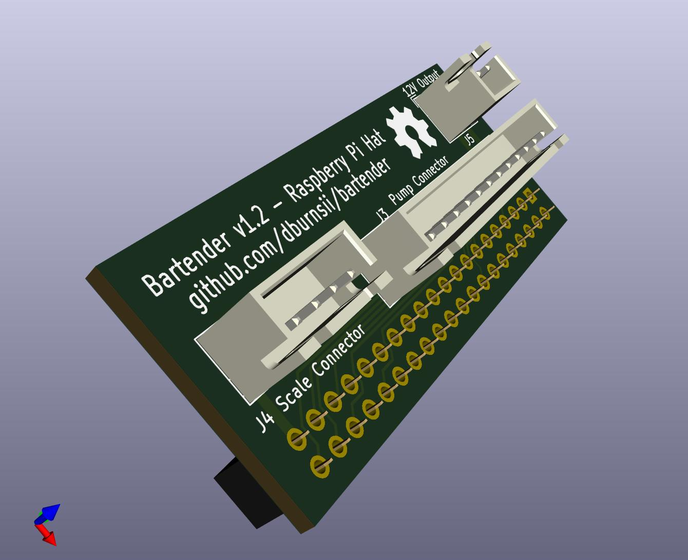

# Hardware

Here you'll find all the hardware you'll need to assemble your own **The Bartender**.
There are quite a few parts you'll need, and most of them can be purchased for very
cheap from eBay, however you'll likely end up with more parts than you'll need for
most things. As this project gains popularity, kits may become available to make
getting started a lot easier.

## Part List
The parts in the parts list were sourced due to their high availability. **The
Bartender** is a relatively advanced system, but it's made up of components that
are easy to get a hold of.

## Cut List

The list of cuts you'll need to make to the single 4'x8' sheet of plywood are
available in .csv format. My current favorite tool for this purpose is
[CutListOptimizer](https://www.cutlistoptimizer.com/). It isn't a FOSS tool,
but you should only need to use it once or twice, optimizing for the blade
you're using to cut the wood. The full 3D model of the bartender is available in
FreeCAD, with assembly instructions to come.

## Roadmap

The intention for this project is to combine and optimize these components
both for bringing down the price, and for ease of accessibility. I personally
(@dburnsii) am not a hardware engineer nor do I have a background in Hardware,
so I recognize that there is a lot of room for improvement in optimizing the
PCBs, cleaning up and optimizing the frame build, etc. My hope is that the
open-source community will band together and make this the drink-making robot
of the future!

### Milestones

#### Single Board Setup
**The Bartender** should have all connections come from the same PCB, rather than
using separate power supplies and a separate pump array board.

 - [ ] Run all 5v components from a 12v -> 5v buck converter (or other step-down)
 - [x] Run Neopixels (accent lighting above bottles) directly from the Pi
 - [ ] Affix the Pump-Controller board components to the Pi Hat
